# Sitecore Personalize EdgeWorker

Runs Sitecore Personalize server-side bucketing **at the Akamai edge** so personalized pages can be served from CDN cache instead of hitting the Next.js origin on every request.

> The mermaid block below renders on GitHub and in VS Code's markdown preview. Azure DevOps wikis use `::: mermaid` / `:::` fences instead of the ```` ```mermaid ```` fence — same diagram body.

```mermaid
flowchart TD
    U["Visitor browser<br/>GET / &nbsp;(URL never changes)"] --> STRIP

    subgraph AKAMAI["AKAMAI EDGE"]
        direction TB
        subgraph OCREQ["EdgeWorker onClientRequest — every request, BEFORE cache lookup"]
            direction TB
            STRIP["Strip spoofable inbound<br/>x-ew-pz-* state headers"] --> GATE{"GET/HEAD and path<br/>in CONFIG.ROUTES?"}
            GATE -->|"no"| PASS["Untouched pass-through"]
            GATE -->|"yes"| INIT["bucket = 'default'<br/>setVariable PMUSER_EW_BUCKET<br/>cacheKey.includeVariable PMUSER_EW_BUCKET<br/>set header x-edge-personalize: 1"]
            INIT --> PREF{"prefetch request?"}
            PREF -->|"yes"| DEFAULTB["Stay on default bucket<br/>(no flow call)"]
            PREF -->|"no"| PVQ{"?pv= test<br/>override?"}
            PVQ -->|"yes"| VALID{"variant in<br/>allowedVariants?"}
            PVQ -->|"no"| BIDQ{"bid_clientKey<br/>cookie present?"}
            BIDQ -->|"no"| CREATE["sub-request 1<br/>GET /__engage/v1.2/browser/create.json<br/>timeout 1s"]
            BIDQ -->|"yes"| CALLF["sub-request 2<br/>POST /__engage/v2/callFlows<br/>channel, clientKey, currencyCode,<br/>friendlyId, language, pointOfSale, browserId,<br/>params: referrer, utm_*, qs_*, cookies_*<br/>timeout 1.5s"]
            CREATE -->|"returns ref = new browser id"| CALLF
            CREATE -->|"fail / timeout"| DEFAULTB
            CALLF -->|"variant id"| VALID
            CALLF -->|"fail / timeout / unassigned"| DEFAULTB
            VALID -->|"no"| DEFAULTB
            VALID -->|"yes"| REWRITE["bucket = variant<br/>setVariable PMUSER_EW_BUCKET<br/>request.route path =<br/>/Page Variants/variant<br/>stash x-ew-pz-gtm payload"]
        end

        REWRITE --> LOOKUP
        DEFAULTB --> LOOKUP
        LOOKUP["Cache lookup<br/>key = URL + PMUSER_EW_BUCKET"] --> HITQ{"cached copy for<br/>this bucket?"}

        STOREB["Cache response under bucket key<br/>edge TTL override, strip Set-Cookie,<br/>downstream no-store"]

        subgraph OCRESPG["EdgeWorker onClientResponse — cache hits AND misses"]
            SETC["new visitor: Set-Cookie bid_clientKey<br/>365d, SameSite=None, Secure<br/>personalized: Set-Cookie sc_personalize_gtm<br/>URL-encoded JSON decision payload"]
        end
        HITQ -->|"hit — origin never called"| SETC
        STOREB --> SETC
    end

    subgraph CDP["SITECORE PERSONALIZE (CDP)"]
        direction TB
        PROXY["Property rule /__engage/* :<br/>origin = api-engage host, strip prefix,<br/>no-store, allow POST"] --> ENGINE["Flow drops guest into 1 of 4 signed-in buckets<br/>(or none — signed-out guests stay default),<br/>records experience execution<br/>(analytics count cache hits too)"]
    end
    CREATE -.-> PROXY
    CALLF -.-> PROXY

    subgraph ORIGIN["ORIGIN — Next.js on AWS EKS"]
        direction TB
        FWD["Forward request<br/>GET /Page Variants/variant<br/>header x-edge-personalize: 1"] --> SKIP["Middleware disabled() sees header,<br/>skips personalize plugin"]
        SKIP --> SSR["SSR of the variant route"]
    end
    HITQ -->|"miss"| FWD
    SSR --> STOREB

    PASS --> NORM["Normal delivery<br/>(cache / origin as usual)"]
    NORM --> RESP
    SETC --> RESP["Response to visitor — URL still /"]
    RESP --> GTM["Browser: PersonalizeGtmSync decodes sc_personalize_gtm,<br/>pushes decision to GTM/Tealium, clears the cookie;<br/>client-side Engage events reuse the same bid"]

    classDef ew fill:#dbeafe,stroke:#1d4ed8,color:#1e3a8a
    classDef akamai fill:#eff6ff,stroke:#3b82f6,color:#1e3a8a
    classDef cdp fill:#ede9fe,stroke:#7c3aed,color:#4c1d95
    classDef origin fill:#dcfce7,stroke:#16a34a,color:#14532d
    classDef failopen fill:#fef3c7,stroke:#b45309,color:#78350f
    classDef client fill:#f1f5f9,stroke:#64748b,color:#0f172a

    class STRIP,GATE,INIT,PREF,PVQ,BIDQ,CREATE,CALLF,VALID,REWRITE,SETC ew
    class LOOKUP,HITQ,STOREB,NORM akamai
    class PROXY,ENGINE cdp
    class FWD,SKIP,SSR origin
    class DEFAULTB,PASS failopen
    class U,RESP,GTM client
```



The decision runs on **every** request (cache hits included) because `onClientRequest` executes before cache lookup — so every visitor gets a fresh Personalize decision and CDP still records the experience execution, while the HTML itself is shared per bucket. The client-facing URL never changes; only the forward request and cache key carry the bucket.

The wire protocol is byte-compatible with what `CustomPersonalizeMiddleware` + `@sitecore/engage@1.4.3` send today (same endpoints, same `params` flattening with `referrer` / `utm_*` / `qs_*` / `cookies_*`, same `?pv=` test override, same `${path}/Page Variants/${variantId}` rewrite, same cookies), so the existing Personalize flows and the client-side `PersonalizeGtmSync` component keep working unchanged.

## Files

| File | Purpose |
|---|---|
| `bundle.json` | EdgeWorkers manifest |
| `main.js` | `onClientRequest` / `onClientResponse` handlers |
| `config.js` | All deployment settings (client key, routes, buckets, timeouts) |
| `engage-client.js` | browser/create + callFlows sub-requests |
| `decision.js` | Experience params, market/POS resolution, flow-result parsing |

## 1. Fill in `config.js`

- `CLIENT_KEY` — value of `NEXT_PUBLIC_ENGAGE_CLIENT_KEY`.
- `ROUTES[0].friendlyId` — the homepage experience friendly id: the value of the page item's `personalizedData` field in Sitecore (what the middleware reads via the `GET_PAGE_VARIANTS_QUERY` GraphQL call).
- `ROUTES[0].allowedVariants` — the raw item names of the 4 variant items under the page's **Page Variants** folder: `Logged-In-Booked`, `Logged-In-Courtesy-Hold`, `Logged-In-Non-Booked`, `Logged-In-Recently-Searched`. This replaces the middleware's runtime `activePageVariants` check; a variant returned by the flow that is not in this list falls back to the default page instead of caching a 404. Every variant is a signed-in state, so a visitor without the `cclUser` cookie cannot match any of them and is served the `default` bucket.
- `COOKIE_DOMAIN` — value of `NEXT_PUBLIC_ENGAGE_COOKIE_DOMAIN` (e.g. `.carnival.com`).
- `ENGAGE_API_BASE` — leave as `/__engage` and add the property rule below, or set an absolute URL **only** if that hostname is itself delivered by Akamai (EdgeWorkers sub-requests cannot reach non-Akamaized hosts).

When Sitecore adds/renames variants, update `allowedVariants` and redeploy (or empty the list to trust the flow, accepting the stale-flow-404 risk).

## 2. Property Manager configuration (required)

1. **EdgeWorkers behavior** on the delivery property, scoped to the personalized page routes (`/` etc.). The worker no-ops on anything not in `ROUTES`, but scoping avoids needless execution.
2. **Declare the cache-key variable**: create user-defined variable `PMUSER_EW_BUCKET` (empty default). `request.setVariable()` throws if it is not declared.
3. **Engage API pass-through rule** — match path `/__engage/*`:
   - Origin Server: the Engage host from `NEXT_PUBLIC_ENGAGE_TARGET_URL` (e.g. `api-engage-us.sitecorecloud.io`), forward Host header = origin hostname.
   - Rewrite the outgoing path to remove the `/__engage` prefix (Modify Outgoing Request Path → Remove `/__engage`).
   - Caching: `no-store`; **Allow POST** enabled (callFlows is a POST).
   - EdgeWorkers sub-requests do not re-trigger EdgeWorkers, so there is no loop risk.
4. **Caching rule for the personalized routes**:
   - Override origin cache-control with the TTL you want at the edge (e.g. 10m–1h) + serve-stale-on-error. The SSR homepage normally responds with a non-cacheable `Cache-Control`, so an explicit edge TTL override is required.
   - Downstream cacheability: `no-store` / `private` — the HTML differs per bucket, so browsers and intermediate proxies must not cache it.
   - Remove `Set-Cookie` from cached origin responses (any per-user cookie the origin sets on a miss must not be replayed to the whole bucket).
   - Cache ID modification: exclude marketing query params (`utm_*`, `gclid`, `fbclid`, …) so campaign traffic doesn't fragment the cache. The `?pv=` override is safe either way because the bucket variable is in the cache key.

## 3. Origin change (one line)

Edge-personalized requests arrive at the origin **already rewritten** to the variant URL with the header `x-edge-personalize: 1`. The origin middleware must skip personalization for them, otherwise it would layer per-user component variants into the shared cached copy. In `src/lib/middleware/plugins/engage.ts`:

```ts
disabled: (req) =>
  process.env.NEXT_PUBLIC_ENABLE_PERSONALIZATION === 'false' ||
  req?.headers.get('x-edge-personalize') === '1',
```

Component-level (micro) personalization is intentionally **not** executed at the edge: per-component variants would explode the cache-key space and defeat caching. Pages served through this worker get page-variant bucketing only.

## 4. Deploy

```bash
cd akamai/edgeworker
tar -czf sitecore-personalize-ew.tgz bundle.json main.js config.js engage-client.js decision.js
akamai edgeworkers register <group-id> sitecore-personalize   # first time only
akamai edgeworkers upload <edgeworker-id> --bundle sitecore-personalize-ew.tgz
akamai edgeworkers activate <edgeworker-id> STAGING <version>
akamai edgeworkers activate <edgeworker-id> PRODUCTION <version>
```

Bump `edgeworker-version` in `bundle.json` on every upload.

## 5. Test

```bash
# Force a bucket (mirrors the middleware's ?pv= test mode; validated against allowedVariants)
curl -sk "https://<staging-host>/?pv=Variant%20A" -H "x-ew-pz-debug: 1" -D - -o /dev/null

# Watch the decision: x-ew-pz-bucket response header shows the chosen bucket
curl -sk "https://<staging-host>/" -H "x-ew-pz-debug: 1" -D - -o /dev/null

# Returning visitor: reuse the bid cookie from the first response
curl -sk "https://<staging-host>/" -H "Cookie: bid_<clientKey>=<ref>" -H "x-ew-pz-debug: 1" -D - -o /dev/null
```

On Akamai staging, add enhanced debug headers (`Pragma: akamai-x-ew-debug, akamai-x-ew-debug-subs, akamai-x-get-cache-key`) to see EdgeWorker execution, sub-request timing and the cache key (which must contain `PMUSER_EW_BUCKET`). `logger` output is visible via `akamai-x-ew-debug` / DataStream 2.

## Behavior notes

- **Fail open, always.** Any exception, non-200, timeout (`BROWSER_CREATE_TIMEOUT_MS` / `CALLFLOWS_TIMEOUT_MS`), unknown variant or missing browser id serves the default page under the `default` bucket. The worker never throws out of a handler and never blocks delivery.
- **`default` is the fifth bucket**: visitors the flow leaves unassigned (and all failure cases) share the un-rewritten page's cache entry — the same behavior as the middleware skipping the rewrite. Because all four variants require a sign-in, `default` is also where the majority of homepage traffic lands, so its hit rate is what the business case rests on.
- **New visitors cost two sub-requests** (browser/create + callFlows, sequential); returning visitors cost one. Both are far cheaper than today's origin middleware chain (Edge GraphQL + layout service + N flow calls) and bounded by the configured timeouts. Note that `browser/create` only ever runs for a visitor with no `bid_` cookie — i.e. a first-touch visitor, who is therefore signed out and can only be assigned `default`. Gating that call on the presence of `cclUser` would remove it from the critical path without changing any outcome; confirm with the flow owner first, since `Logged-In-Recently-Searched` may draw on CDP history rather than a cookie.
- **Prefetches** (`purpose`/`sec-purpose: prefetch`, `next-router-prefetch`) skip the flow call — same as the middleware — so experiment metrics aren't inflated; they're served the default bucket.
- **Analytics parity**: the callFlows execution itself registers the experience view in CDP per request (cache hits included), the `bid` cookie keeps the guest consistent for client-side events, and `sc_personalize_gtm` feeds `PersonalizeGtmSync` exactly as before (URL-encoded JSON — the component already decodes it).
- **Bot traffic**: each cookieless request creates a CDP guest. If bot volume is a concern, gate the worker's routes behind Akamai Bot Manager, or short-circuit known bots to the default bucket in the property before the EdgeWorkers behavior.
