# Sitecore Personalize EdgeWorker

Runs Sitecore Personalize server-side bucketing **at the Akamai edge** so personalized pages can be served from CDN cache instead of hitting the Next.js origin on every request.

> The mermaid block below renders on GitHub and in VS Code's markdown preview. Azure DevOps wikis use `::: mermaid` / `:::` fences instead of the ```` ```mermaid ```` fence — same diagram body.

```mermaid
flowchart TD
    U["Visitor browser<br/>GET / &nbsp;(URL never changes)"] --> STRIP

    subgraph AKAMAI["AKAMAI EDGE"]
        direction TB
        subgraph OCREQ["EdgeWorker onClientRequest — every request, BEFORE cache lookup"]
            direction TB
            STRIP["Strip spoofable inbound<br/>x-ew-pz-* state headers"] --> GATE{"GET/HEAD and host+path<br/>in CONFIG.ROUTES?"}
            GATE -->|"no"| PASS["Untouched pass-through"]
            GATE -->|"yes"| INIT["bucket = 'default'<br/>setVariable PMUSER_EW_BUCKET<br/>cacheKey.includeVariable PMUSER_EW_BUCKET<br/>set header x-edge-personalize: 1"]
            INIT --> PREF{"prefetch request?"}
            PREF -->|"yes"| DEFAULTB["Stay on default bucket<br/>(no flow call)"]
            PREF -->|"no"| PVQ{"?pv= test<br/>override?"}
            PVQ -->|"yes"| VALID{"variant in<br/>allowedVariants?"}
            PVQ -->|"no"| BIDQ{"bid_clientKey<br/>cookie present?"}
            BIDQ -->|"no"| CREATE["sub-request 1<br/>GET /__engage/v1.2/browser/create.json<br/>timeout 1s"]
            BIDQ -->|"yes"| CALLF["sub-request 2<br/>POST /__engage/v2/callFlows<br/>channel, clientKey, currencyCode,<br/>friendlyId, language, pointOfSale, browserId,<br/>params: referrer, utm_*, qs_*, cookies_*<br/>timeout 1.5s"]
            CREATE -->|"returns ref = new browser id"| CALLF
            CREATE -->|"fail / timeout"| DEFAULTB
            CALLF -->|"variant id"| VALID
            CALLF -->|"fail / timeout / unassigned"| DEFAULTB
            VALID -->|"no"| DEFAULTB
            VALID -->|"yes"| REWRITE["bucket = variant<br/>setVariable PMUSER_EW_BUCKET<br/>request.route path =<br/>/Page Variants/variant<br/>stash x-ew-pz-gtm payload"]
        end

        REWRITE --> LOOKUP
        DEFAULTB --> LOOKUP
        LOOKUP["Cache lookup<br/>key = URL + PMUSER_EW_BUCKET"] --> HITQ{"cached copy for<br/>this bucket?"}

        STOREB["Cache response under bucket key<br/>edge TTL override, strip Set-Cookie,<br/>downstream no-store"]

        subgraph OCRESPG["EdgeWorker onClientResponse — cache hits AND misses"]
            SETC["new visitor: Set-Cookie bid_clientKey<br/>365d, SameSite=None, Secure<br/>personalized: Set-Cookie sc_personalize_gtm<br/>URL-encoded JSON decision payload"]
        end
        HITQ -->|"hit — origin never called"| SETC
        STOREB --> SETC
    end

    subgraph CDP["SITECORE PERSONALIZE (CDP)"]
        direction TB
        PROXY["Property rule /__engage/* :<br/>origin = api-engage host, strip prefix,<br/>no-store, allow POST"] --> ENGINE["Flow assigns guest to one of the<br/>configured variants (or none — stays default),<br/>records experience execution<br/>(analytics count cache hits too)"]
    end
    CREATE -.-> PROXY
    CALLF -.-> PROXY

    subgraph ORIGIN["ORIGIN — Next.js on AWS EKS"]
        direction TB
        FWD["Forward request<br/>GET /Page Variants/variant<br/>header x-edge-personalize: 1"] --> SKIP["Middleware disabled() sees header,<br/>skips personalize plugin"]
        SKIP --> SSR["SSR of the variant route"]
    end
    HITQ -->|"miss"| FWD
    SSR --> STOREB

    PASS --> NORM["Normal delivery<br/>(cache / origin as usual)"]
    NORM --> RESP
    SETC --> RESP["Response to visitor — URL still /"]
    RESP --> GTM["Browser: PersonalizeGtmSync decodes sc_personalize_gtm,<br/>pushes decision to GTM/Tealium, clears the cookie;<br/>client-side Engage events reuse the same bid"]

    classDef ew fill:#dbeafe,stroke:#1d4ed8,color:#1e3a8a
    classDef akamai fill:#eff6ff,stroke:#3b82f6,color:#1e3a8a
    classDef cdp fill:#ede9fe,stroke:#7c3aed,color:#4c1d95
    classDef origin fill:#dcfce7,stroke:#16a34a,color:#14532d
    classDef failopen fill:#fef3c7,stroke:#b45309,color:#78350f
    classDef client fill:#f1f5f9,stroke:#64748b,color:#0f172a

    class STRIP,GATE,INIT,PREF,PVQ,BIDQ,CREATE,CALLF,VALID,REWRITE,SETC ew
    class LOOKUP,HITQ,STOREB,NORM akamai
    class PROXY,ENGINE cdp
    class FWD,SKIP,SSR origin
    class DEFAULTB,PASS failopen
    class U,RESP,GTM client
```



The decision runs on **every** request (cache hits included) because `onClientRequest` executes before cache lookup — so every visitor gets a fresh Personalize decision and CDP still records the experience execution, while the HTML itself is shared per bucket. The client-facing URL never changes; only the forward request and cache key carry the bucket.

The wire protocol is byte-compatible with what `CustomPersonalizeMiddleware` + `@sitecore/engage@1.4.3` send today (same endpoints, same `params` flattening with `referrer` / `utm_*` / `qs_*` / `cookies_*`, same `?pv=` test override, same `${path}/Page Variants/${variantId}` rewrite, same cookies), so the existing Personalize flows and the client-side `PersonalizeGtmSync` component keep working unchanged.

## Files

| File | Purpose |
|---|---|
| `bundle.json` | EdgeWorkers manifest |
| `main.js` | Everything: handlers, decision helpers, Engage sub-requests |
| `config.js` | All deployment settings (client key, routes, markets, timeouts) |
| `test/` | Local test harness (mocked Akamai runtime) — **not** part of the bundle |
| `probes/` | Scripts querying the real Edge GraphQL / Engage APIs to source + verify config values — **not** part of the bundle |
| `package.json` | Local test support only — **not** part of the bundle |

## US + AU: one EdgeWorker, two properties

The US and AU sites live on separate Akamai properties, and both homepages are personalized. The same code bundle covers both; the Akamai team can deploy it either way:

- **One EdgeWorker ID attached to both properties** — routes are distinguished by the `hosts` filter in `ROUTES` (host-filtered AU route first, US route after it).
- **A separate EdgeWorker ID per property** — same bundle, optionally with a per-property `config.js`; the `hosts` filters can then be left empty.

Either way, **every property** running the worker needs the full Property Manager configuration below (the `PMUSER_EW_BUCKET` variable, the `/__engage` pass-through rule, and the caching rules).

Rollout is **US first**; the AU route ships as inert placeholders (its TODO `friendlyId`/`allowedVariants` can never match a flow result, so AU serves the default page) until its values are filled in.

**Forward path (decided for US, expected same for AU):** clients request `/` and the US property forwards **`/home`** to the Next.js origin — matching the nonprod mounting (`dev.carnival.com/home`) — so the US route sets `originPath: '/home'` and the variant rewrite is `/home/Page Variants/<variant>`. The property's own `/` → `/home` rewrite must not re-apply to the EdgeWorker's rewritten forward path. ⚠️ URL paths resolve relative to the site start item: the JSS app's site root is `/sitecore/content/home`, its start item is `…/home/homepage` (what URL `/` resolves to), and URL `/home` resolves to the child item `/sitecore/content/home/homepage/home` — a *different* item. The `personalized` flag, `PersonalizedData` (friendlyId) and the **Page Variants** folder must be authored on the item the forward path resolves to — with `'/' → '/home'` forwarding, that is `/sitecore/content/home/homepage/home` (the TST demo pages live under it, e.g. `…/homepage/home/demo`). Language carries no path prefix on either site — the domain determines it (AU serves the en-AU language version of the same content) — so the AU client path is also `/`; confirm the AU property's forward path (expected `/home` as well) during the AU phase and set the AU route's `originPath` accordingly.

**Environments:** TST3 = `www3.nonprod.carnivalcloud.net`, TST4 = `www4.nonprod.carnivalcloud.net` (fronted by `dev.carnival.com`); Personalize is being configured for Pre1, then Prod. The Akamai cache **must** be live before Prod — the origin cannot take homepage traffic uncached. Prod Engage values are assumed to match nonprod for now (same tenant); everything is in `config.js` to swap at go-live.

## 1. Fill in `config.js`

- `CLIENT_KEY` — value of `NEXT_PUBLIC_ENGAGE_CLIENT_KEY`.
- Per route in `ROUTES` (one entry per personalized homepage — AU first, US second):
  - `hosts` — lowercase hostnames of that property (AU hostname is a TODO). May stay `[]` when each property has its own EdgeWorker.
  - `paths` / `originPath` — see the AU open question above.
  - `friendlyId` — the page's experience friendly id: the value of the page item's `personalizedData` field in Sitecore (what the middleware reads via the `GET_PAGE_VARIANTS_QUERY` GraphQL call). The AU value is a TODO.
  - `allowedVariants` — the raw item names of the variant items under that page's **Page Variants** folder (currently the four `Logged-In-*` items for US; the AU list is a TODO). This replaces the middleware's runtime `activePageVariants` check; a variant returned by the flow that is not in this list falls back to the default page instead of caching a 404. More variants (including non-logged-in ones) are planned — add them here and redeploy when they exist in Sitecore.
  - `market` / `selectedCurrencyMarkets` — pre-filled: US is `carnivalUS`/USD; AU is `carnivalAU`/AUD with the `SelectedCurrency` cookie (AUD | NZD) switching POS + currency, mirroring `getPersonalizeContext()`.
- `COOKIE_DOMAIN` — value of `NEXT_PUBLIC_ENGAGE_COOKIE_DOMAIN` (e.g. `.carnival.com`). Leave empty if one EdgeWorker serves the US and AU domains.
- `ENGAGE_API_BASE` — leave as `/__engage` and add the property rule below, or set an absolute URL **only** if that hostname is itself delivered by Akamai (EdgeWorkers sub-requests cannot reach non-Akamaized hosts). Note the AU property may need a different Engage host (e.g. an AP region endpoint) — confirm with the Personalize tenant setup.

After editing, run the local test suite (below) — `config.test.js` validates the config's structure and route ordering.

## 2. Property Manager configuration (required, per property)

1. **EdgeWorkers behavior** on the delivery property, scoped to the personalized page routes (`/` etc.). The worker no-ops on anything not in `ROUTES`, but scoping avoids needless execution.
2. **Declare the cache-key variable**: create user-defined variable `PMUSER_EW_BUCKET` (empty default). `request.setVariable()` throws if it is not declared.
3. **Engage API pass-through rule** — match path `/__engage/*`:
   - Origin Server: the Engage host from `NEXT_PUBLIC_ENGAGE_TARGET_URL` (e.g. `api-engage-us.sitecorecloud.io`), forward Host header = origin hostname.
   - Rewrite the outgoing path to remove the `/__engage` prefix (Modify Outgoing Request Path → Remove `/__engage`).
   - Caching: `no-store`; **Allow POST** enabled (callFlows is a POST).
   - EdgeWorkers sub-requests do not re-trigger EdgeWorkers, so there is no loop risk.
4. **Caching rule for the personalized routes**:
   - Override origin cache-control with the TTL you want at the edge (e.g. 10m–1h) + serve-stale-on-error. The SSR homepage normally responds with a non-cacheable `Cache-Control`, so an explicit edge TTL override is required.
   - Downstream cacheability: `no-store` / `private` — the HTML differs per bucket, so browsers and intermediate proxies must not cache it.
   - Remove `Set-Cookie` from cached origin responses (any per-user cookie the origin sets on a miss must not be replayed to the whole bucket).
   - Cache ID modification: exclude marketing query params (`utm_*`, `gclid`, `fbclid`, …) so campaign traffic doesn't fragment the cache. The `?pv=` override is safe either way because the bucket variable is in the cache key.

## 3. Origin change (one line)

Edge-personalized requests arrive at the origin **already rewritten** to the variant URL with the header `x-edge-personalize: 1`. The origin middleware must skip personalization for them, otherwise it would layer per-user component variants into the shared cached copy. In `src/lib/middleware/plugins/engage.ts`:

```ts
disabled: (req) =>
  process.env.NEXT_PUBLIC_ENABLE_PERSONALIZATION === 'false' ||
  req?.headers.get('x-edge-personalize') === '1',
```

Component-level (micro) personalization is intentionally **not** executed at the edge: per-component variants would explode the cache-key space and defeat caching. Pages served through this worker get page-variant bucketing only.

## 4. Validate locally (no Akamai account needed)

The `test/` folder contains a full local test suite: it mocks the four Akamai built-in modules the worker uses (`http-request`, `cookies`, `log`, `url-search-params`) plus the Engage API, and runs the whole behavior matrix — routing/pass-through, new vs returning visitor, every fail-open path, `?pv=` test mode, prefetch guard, AU market/`SelectedCurrency` resolution, cookie budgets, `Set-Cookie` output, header-spoofing protection, and flow-result parsing. Requires Node 20+ (no npm install):

```bash
cd akamai/edgeworker
node --import ./test/register.mjs --test "./test/*.test.js"
```

Run it after any change to `main.js` or `config.js`. `config.test.js` validates the deployed config's structure (and catches ordering mistakes like a host-filtered route shadowed by a catch-all, or a friendlyId the Engage API would reject), so it's also the pre-deploy check after filling in the TODOs.

`probes/` complements the offline suite with two scripts that hit the real APIs: `probe-content.sh` pulls each homepage's `personalizedData` (→ `friendlyId`) and `activePageVariants` (→ `allowedVariants`) from Experience Edge so config values are sourced, not transcribed; `probe-callflows.sh` runs one real browser-create + callFlows and prints the raw flow response (the shape `extractVariantId` must parse, and the exact variant naming). They are bash scripts — run them from Git Bash, or from Windows PowerShell as `bash probe-content.sh` (note PowerShell 5.x doesn't support `&&`; use `;` to chain a `cd`).

### End-to-end: the local Akamai simulator

`test/local-simulator.mjs` runs the **real `main.js` handlers** with **live Engage sub-requests** around an in-memory per-bucket cache in front of the local dev origin — the same lifecycle Akamai implements (decision before cache lookup, cache key = URL + bucket variable with the `route()` path excluded, forward-on-miss with the worker's mutated headers, Set-Cookie stripped from cached responses, `onClientResponse` on hits and misses). It targets the TST demo page (`/home/demo`), whose flow and variants are live. With the repo dev server running:

```bash
cd akamai/edgeworker
EW_HTTP=live node --import ./test/register.mjs test/local-simulator.mjs
```

then, in a second terminal:

```bash
cd akamai/edgeworker
node test/run-scenarios.mjs
```

The driver exercises 11 scenarios / 37 checks against the real flow and real origin: anonymous vs logged-in bucketing, per-bucket cache isolation (verified by body hash), decisions and cookies on cache **hits**, `?pv=` override, prefetch, spoofed-header protection, pass-through, and fail-open under a forced 1 ms timeout. You can also browse `http://localhost:3100/home/demo` directly (send a `cclUser=1` cookie to land in a variant bucket).

This harness has already paid for itself once: the live Engage API answers `browser/create.json` with **HTTP 201**, which the original `status !== 200` check treated as a failure — every new visitor would have silently fallen to the default bucket in production. The status checks now accept any 2xx.

**Verified origin contract** (direct curls against the dev origin): with `x-edge-personalize: 1` the middleware fully skips (no rewrite, no `sc_personalize_gtm`, no bid cookie, no component personalization — zero Set-Cookie headers), and the variant forward path SSRs 200. The origin answers `Cache-Control: no-store, must-revalidate`, confirming the property **must** apply the edge-TTL override for caching to happen at all.

What the harness **cannot** validate: Property Manager behavior (the `PMUSER_EW_BUCKET` declaration, the `/__engage` origin swap, caching rules), real Engage API responses, and EdgeWorkers resource limits. Those are covered by the staging checks below, which the Akamai developer runs.

## 5. Deploy

```bash
cd akamai/edgeworker
tar -czf sitecore-personalize-ew.tgz bundle.json main.js config.js
akamai edgeworkers register <group-id> sitecore-personalize   # first time only
akamai edgeworkers upload <edgeworker-id> --bundle sitecore-personalize-ew.tgz
akamai edgeworkers activate <edgeworker-id> STAGING <version>
akamai edgeworkers activate <edgeworker-id> PRODUCTION <version>
```

Bump `edgeworker-version` in `bundle.json` on every upload. `test/` and `package.json` are local tooling and stay out of the bundle.

## 6. Test on Akamai staging

```bash
# Force a bucket (mirrors the middleware's ?pv= test mode; validated against allowedVariants)
curl -sk "https://<staging-host>/?pv=Variant%20A" -H "x-ew-pz-debug: 1" -D - -o /dev/null

# Watch the decision: x-ew-pz-bucket response header shows the chosen bucket
curl -sk "https://<staging-host>/" -H "x-ew-pz-debug: 1" -D - -o /dev/null

# Returning visitor: reuse the bid cookie from the first response
curl -sk "https://<staging-host>/" -H "Cookie: bid_<clientKey>=<ref>" -H "x-ew-pz-debug: 1" -D - -o /dev/null
```

On Akamai staging, add enhanced debug headers (`Pragma: akamai-x-ew-debug, akamai-x-ew-debug-subs, akamai-x-get-cache-key`) to see EdgeWorker execution, sub-request timing and the cache key (which must contain `PMUSER_EW_BUCKET`). `logger` output is visible via `akamai-x-ew-debug` / DataStream 2.

## 7. Debugging and troubleshooting once deployed

**Layer 1 — the worker's own debug headers (production-safe, per request, no Akamai tooling).** Send `x-ew-pz-debug: 1` and the response echoes the decision:

```bash
curl -s "https://www.carnival.com/" -H "x-ew-pz-debug: 1" -D - -o /dev/null | grep -i x-ew-pz
```

`x-ew-pz-bucket` says which cached copy was served; `x-ew-pz-reason` says why:

| Reason | Meaning |
|---|---|
| `flow` | Flow assigned a valid variant — personalization working |
| `flow-unassigned` | Flow executed, visitor not assigned — expected for most anonymous traffic |
| `flow-error` | callFlows failed / timed out / non-2xx → check the `/__engage` rule and Engage health |
| `no-browser-id` | browser/create failed / timed out → same checks |
| `flow-unknown-variant` | Flow returned a variant not in `allowedVariants` → config out of sync with Sitecore |
| `pv-override` / `pv-invalid` | `?pv=` test mode (accepted / rejected) |
| `prefetch` | Prefetch request; decision intentionally skipped |
| `error` | Unexpected exception in the worker → read the JS logs |

Gated by `CONFIG.DEBUG` + the request header; reveals nothing sensitive, so it can stay on in production.

**Layer 2 — Akamai enhanced debug (per request).** On staging, send the `Pragma` headers above. On **production**, the same headers work when accompanied by a time-limited trace token: generate one with `akamai edgeworkers auth <hostname>` and send it as `Akamai-EW-Trace: <token>`. You get: the `X-Akamai-EdgeWorkers` response header (worker id/version, status — `Success`, `ExecutionError`, wall/CPU timeout — and execution time), per-sub-request status + timing via `akamai-x-ew-debug-subs` (this is where Engage latency problems show), and the worker's `logger` output in the `X-Akamai-EdgeWorkers-Log` response header — every failure path in this worker logs with a `pz:` prefix. `akamai-x-get-cache-key` confirms the bucket variable is in the cache key.

**Layer 3 — continuous logging via DataStream 2.** Enable EdgeWorkers JavaScript Logging on the property's DataStream 2 stream to deliver `logger` output continuously to a log endpoint (Splunk / S3 / etc.); the log level can be adjusted per EdgeWorker from the CLI without redeploying. Separately — and highly recommended — add `PMUSER_EW_BUCKET` as a DataStream 2 custom field so every CDN log line carries the visitor's bucket. **Bucket distribution is the primary health metric**: because the worker fails open, an outage doesn't look like errors — it looks like the `default` share climbing toward 100%. Alert on that.

**Layer 4 — Control Center.** The EdgeWorkers reports show executions, error counts by type, and init/execution-time percentiles per version — check them after every activation. Mind the resource tier: the worker makes up to two sequential sub-requests (worst case ~2.5s of wall time under the configured timeouts).

**Symptom → where to look:**

| Symptom | Likely cause / check |
|---|---|
| Everyone default, reason `flow-error` or `no-browser-id` | `/__engage` rule broken (origin swap, prefix strip, POST allowed) or Engage slow/down — check `akamai-x-ew-debug-subs` timings |
| Everyone default, reason `flow-unassigned`, but assignments expected | friendlyId/flow mismatch — run `probes/probe-callflows.sh` with the prod values |
| Everyone default, reason `error`, or EW status `ExecutionError` | JS exception — read the logs (Layer 2/3) |
| Reason `flow-unknown-variant` appearing | Sitecore variants changed; update `allowedVariants` and redeploy |
| Users report wrong/mixed content | Cache key missing the bucket (`akamai-x-get-cache-key`), Set-Cookie not stripped from cached responses, or downstream caching not `no-store` |
| Variant 404 served for a whole bucket | `allowedVariants` lists a variant that no longer exists, or content authored on the wrong item |
| Works on staging, not production | `PMUSER_EW_BUCKET` variable or property rules missing on the production property |

## Behavior notes

- **Fail open, always.** Any exception, non-200, timeout (`BROWSER_CREATE_TIMEOUT_MS` / `CALLFLOWS_TIMEOUT_MS`), unknown variant or missing browser id serves the default page under the `default` bucket. The worker never throws out of a handler and never blocks delivery.
- **`default` is the extra bucket**: visitors the flow leaves unassigned (and all failure cases) share the un-rewritten page's cache entry — the same behavior as the middleware skipping the rewrite. With today's logged-in-only variant list it's where most traffic lands; as non-logged-in variants are added, traffic shifts into more buckets and each new variant adds one more cached copy per page.
- **New visitors cost two sub-requests** (browser/create + callFlows, sequential); returning visitors cost one. Both are far cheaper than today's origin middleware chain (Edge GraphQL + layout service + N flow calls) and bounded by the configured timeouts.
- **Prefetches** (`purpose`/`sec-purpose: prefetch`, `next-router-prefetch`) skip the flow call — same as the middleware — so experiment metrics aren't inflated; they're served the default bucket.
- **Analytics parity**: the callFlows execution itself registers the experience view in CDP per request (cache hits included), the `bid` cookie keeps the guest consistent for client-side events, and `sc_personalize_gtm` feeds `PersonalizeGtmSync` exactly as before (URL-encoded JSON — the component already decodes it).
- **Bot traffic**: each cookieless request creates a CDP guest. If bot volume is a concern, gate the worker's routes behind Akamai Bot Manager, or short-circuit known bots to the default bucket in the property before the EdgeWorkers behavior.
